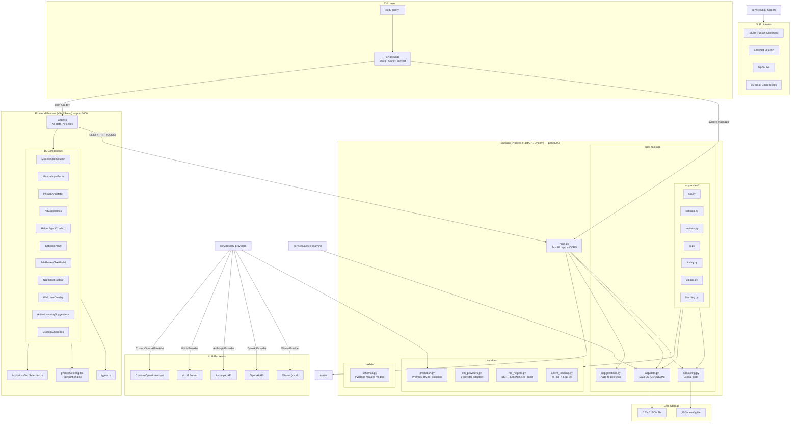

# AnnoABSA Architecture

## Overview

AnnoABSA is a **two-process web application** for Aspect-Based Sentiment Analysis (ABSA) annotation. It consists of a **FastAPI Python backend** (serving a REST API) and a **React SPA frontend** (served via Vite dev server). The backend does all data management, AI inference, and NLP analysis; the frontend provides the interactive annotation UI.

A **CLI** (`cli.py`) orchestrates launching both processes and configuring the tool from the command line.

---

## High-Level Architecture Diagram



---

## Data Flow

### Annotation Workflow
```
CSV/JSON file → load_data() → pandas/JSON → 
  API (GET /data/{idx}) → React state → 
    User annotates via UI → 
      POST /review/{idx}/save → save_data() → CSV/JSON file
```

### AI Prediction Flow
```
GET /ai_prediction/{idx} →
  load_data() → collect labeled examples → 
    BM25 few-shot retrieval → build prompt →
      LLM provider (Ollama/OpenAI/Anthropic/vLLM) →
        structured JSON (Pydantic) →
          phrase position resolution →
            return predictions to frontend
```

### Compare Mode (CSV)
```
GET /data/{idx} →
  load_data() → read aspect_triplets / new_triplets columns
    OR _load_comparison_csv(model_a_csv), _load_comparison_csv(model_b_csv) →
      return model_a_triplets + model_b_triplets →
        React compare view (ModelTripletColumn x2)
```

### Live Compare Mode
```
GET /live_prediction/{idx}?role=model_a (or model_b) →
  per-model provider config →
    separate LLM call per model →
      return side-by-side predictions
```

---

## Annotation Data Model

Each review stores annotations as a list of **triplets** (aspect term, aspect category, sentiment polarity) + optional opinion term + character positions:

```json
[
  {
    "aspect_term": "hamburgeri",
    "aspect_category": "FOOD#QUALITY",
    "sentiment_polarity": "positive",
    "opinion_term": "hoşuma gidiyor",
    "at_start": 0,
    "at_end": 9,
    "ot_start": 12,
    "ot_end": 26
  }
]
```

In CSV format, the label column stores a JSON-encoded string of this array.

---

## Backend Architecture

### entry point: `main.py`
- Creates FastAPI app with CORS middleware (all origins allowed)
- Imports and mounts 7 route modules
- On startup: calls `auto_add_missing_positions()` if enabled

### `app/config.py` — Global State
- `DATA_FILE_PATH`, `DATA_FILE_TYPE`, `CONFIG_PATH`, `CONFIG_DATA`
- `CONFIG_DATA` holds: sentiment elements, categories, polarities, LLM settings, compare mode settings, theme
- Provides `set_data_file()`, `set_config_file()`, `load_config()`, `set_config()`

### `app/data.py` — Data I/O
- `load_data()`: reads CSV (pandas) or JSON
- `save_data()`: writes CSV or JSON
- `parse_triplet_column()`: parses Python-list-literal strings to triplet dicts
- `_load_comparison_csv()`: loads model comparison CSVs (STD or per-row format)
- `get_total_count()`, `get_current_index()`, `max_number_of_idxs()`: metadata helpers

### `app/positions.py` — Position Auto-Fill
- `auto_add_missing_positions()`: scans annotations, finds aspect/opinion terms in text, adds `at_start`/`at_end`/`ot_start`/`ot_end`

### Route Modules

| File | Prefix | Endpoints | Purpose |
|------|--------|-----------|---------|
| `routes/nlp.py` | `/nlp` | 4 GET | NLP toolbar: lexicon polarity, BERT sentiment, morphology, embedding similarity |
| `routes/reviews.py` | — | 3 endpoints | GET /data/{idx}, POST /review/{idx}/save, POST /agent/chat |
| `routes/settings.py` | — | 2 endpoints | GET /settings, PATCH /settings |
| `routes/ai.py` | — | 2 endpoints | GET /ai_prediction/{idx}, GET /live_prediction/{idx} |
| `routes/timing.py` | — | 2 endpoints | POST /timing/{idx}, GET /avg-annotation-time |
| `routes/upload.py` | — | 2 endpoints | POST /upload-data, POST /auto-add-positions |
| `routes/learning.py` | — | 2 endpoints | GET /learning/suggestions, GET /learning/predict/{idx} |

### Service Modules

| File | Purpose |
|------|---------|
| `services/llm_providers.py` | Hexagonal provider pattern: **LLMProviderPort** protocol, 5 adapters (Ollama, OpenAI, Anthropic, vLLM, CustomOpenAI), registry, factory (`get_provider()`), derivation (`_derive_provider()`), validation |
| `services/prediction.py` | Prompt building (`build_prediction_prompt`), BM25 few-shot retrieval (`get_most_similar_examples`), dynamic Pydantic model generation (`build_absa_models`), phrase position finding (`find_phrase_positions`), mock reasoning generation |
| `services/nlp_helpers.py` | Lazy-loaded NLP tools: SentiNet lexicon lookup, BERT sentiment classifier, NlpToolkit morphological analyzer, e5-small embedding similarity |
| `services/active_learning.py` | TF-IDF + LogisticRegression (OneVsRestClassifier) with entropy-based uncertainty sampling for Label Studio-style active learning |

### Models
- `models/schemas.py`: `SaveTripletsRequest` (POST body for save), `AgentChatRequest` (POST body for chat)
- Dynamic Pydantic models built at runtime in `prediction.py` for structured LLM output (Aspects, SentimentElement enums)

---

## Frontend Architecture

### Entry: `frontend/src/index.tsx` → `App.tsx` (root component)

### State Management
All state is in `App.tsx` via `useState` hooks (no Redux/Context):
- `currentIndex`, `currentData`, `totalCount`, `settings`
- `selectedModelAIds`, `selectedModelBIds` (sets of selected triplet IDs)
- `manualTriplets` (user-created triplets from ManualInputForm)
- `aiSuggestions`, `liveModelATriplets`, `liveModelBTriplets`
- `chatMessages`, `nlpToolbarSelection`, `saveToast`, `mode`, etc.

### Component Tree
```
App
├── ModelTripletColumn (x2: Model A, Model B)
│   └── CustomCheckbox (per triplet)
├── ManualInputForm
├── PhraseAnnotator (review text with click-to-select)
├── AISuggestions
├── HelperAgentChatbox
├── SettingsPanel
├── EditReviewTextModal
├── NlpHelperToolbar
├── WelcomeOverlay
├── ActiveLearningSuggestions
└── Toast (saveToast)
```

### Key Files
| File | Purpose |
|------|---------|
| `types.ts` | All TypeScript interfaces: `TripletItem`, `ReviewComparisonData`, `ChatMessage`, `Settings`, `AppActions` |
| `phraseColoring.tsx` | Color engine: 25 Tailwind color classes, character-level highlight rendering with overlap mixing |
| `hooks/useTextSelection.ts` | DOM Range-based text selection with token snapping and phrase cleaning |

### Data Flow
1. On load: `GET /settings` → populate `Settings`
2. `GET /data/{index}` → populate `currentData` (review text, model A/B triplets, label, reasoning)
3. User interacts: selects checkboxes, fills form, clicks text → updates local state
4. On "next review": `POST /review/{index}/save` → saves approved triplets + manual triplets
5. AI predictions: `GET /ai_prediction/{index}` (or live mode: `GET /live_prediction/{index}?role=model_a/b`)
6. Settings changes: `PATCH /settings` → persists to config JSON file

---

## CLI Architecture

### Entry: `cli.py` → `cli/__init__.py:main()`

The CLI combines argument parsing, config management, and process spawning:

```
cli.py → cli/__init__.py (argparse + dispatch)
         ├── cli/config.py (ABSAAnnotatorConfig — config builder/saver/loader)
         ├── cli/runner.py (start_backend, start_frontend, start_full_app)
         └── cli/convert.py (std_triplets_to_label — STD format conversion)
```

1. Parses arguments (data path, LLM config, server ports, feature flags)
2. Creates `ABSAAnnotatorConfig` from args + optional JSON config file
3. Saves config to `temp/temp_absa_config.json`
4. Starts backend via `uvicorn main:app` (subprocess)
5. Starts frontend via `npm run dev` in `frontend/` (subprocess)
6. Cleans up both processes on exit

---

## LLM Provider Hexagonal Architecture

```
LLMProviderPort (Protocol)
  ├── predict(text, elements, examples, categories, polarities, ...) → dict
  └── chat(messages, model, temperature) → str

OllamaProvider      — ollama Python library, structured JSON output (Pydantic schema)
OpenAIProvider      — openai Python lib, beta.parse structured output
AnthropicProvider   — anthropic Python lib, manual JSON extraction
VLLMProvider        — OpenAI-compatible, no structured output support (manual JSON)
CustomOpenAIProvider — any OpenAI-compatible endpoint, tries structured output first

PROVIDER_REGISTRY → {name: class}
get_provider(name, config) → instance
_derive_provider(config) → name
validate_provider_config(name, config) → errors[]
validate_per_model_config(role, config) → errors[]
```

---

## Key Design Decisions

1. **Two-process architecture**: Backend and frontend are independent servers communicating via REST. No SSR, no tight coupling.
2. **File-based storage**: No database — annotations persisted to CSV or JSON files directly. Simple, portable, auditable.
3. **Global mutable state** (`app/config.py`): Single module holds all runtime config. Mutated by CLI, settings API, and uploads. Simple but not thread-safe.
4. **Lazy-loaded NLP tools**: SentiNet, BERT, NlpToolkit, e5-small models loaded on first use only (module-level singletons). Keeps startup fast.
5. **Dynamic Pydantic models for structured output**: LLM prompts use dynamically generated Pydantic models with enums derived from the actual review text, constraining the model to valid phrases only.
6. **Hexagonal provider adapters**: All LLM backends implement the same `predict()`/`chat()` protocol, making them drop-in replaceable.
7. **Fallback data in frontend**: When backend is unreachable, `App.tsx` falls back to hardcoded `FALLBACK_DATA` for development/demo.
8. **Character-level text selection**: The `useTextSelection` hook walks the DOM to compute character offsets, handling fragmented text nodes from annotation highlighting.

---

## File Format Support

| Format | Input | Output | Notes |
|--------|-------|--------|-------|
| CSV | ✅ | ✅ | Default format, pandas-based |
| JSON | ✅ | ✅ | Array of objects with `text`/`review_text` + `label` |
| STD CSV | ✅ | ✅ (via `--export-std`) | Two-column `review, triplet` format |
